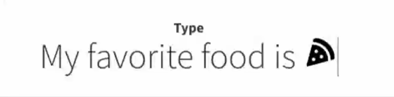

# Animated Headlines Web Component

Animated Headlines with interchangeable words that replace one another through CSS transitions.  

  
See [demo](https://vianetz.github.io/animated-headlines-vanilla/).


## Installation

### npm

```bash
npm install @vianetz/animated-headlines-vanilla
```

## Default Usage

Include the CSS and JavaScript in your head:

```html
<link rel="stylesheet" src="dist/animated-headline.css">
<script src="dist/animated-headline.js" defer></script>
```

Then use the following markup:

```html
<h1>
    My favorite food is
    <via-animated-headline animation="rotate-1">
        <b>pizza</b>
        <b hidden>sushi</b>
        <b hidden>steak</b>
    </span>
</h1>
```

## Advanced Usage

## Options

The Animated Headlines component provides multiple attributes to customize different animation settings depending on the type, e.g.:

| Option      | Description                                                                                                                       |
|-------------|-----------------------------------------------------------------------------------------------------------------------------------|
| `animation` | The animation effect, one of: `rotate-1`, `rotate-2`, `rotate-3`, `type`, `loading-bar`, `slide`, `clip`, `zoom`, `scale`, `push` |
| `hold`      | Seconds to wait before starting a new animation cycle                                                                             |
| `delay`     | Seconds to delay the effect, e.g. typing or rotating                                                                              |

The options are set as html attributes on the custom component like this:
```html
<via-animated-headline animation="type" hold="3000" delay="1000">
```

See also [demo source](demo/index.html) for a full list of options for all types.

## Events

This web component emits the following events that you can listen to (should be rather self-explanatory):
- `via-animated-headline:ready`
- `via-animated-headline:resized`
- `via-animated-headline:started`
- `via-animated-headline:stopped`
- `via-animated-headline:word-replaced`

## License

Animated Headlines is open-sourced software licensed under the [MIT license](https://opensource.org/license/MIT).